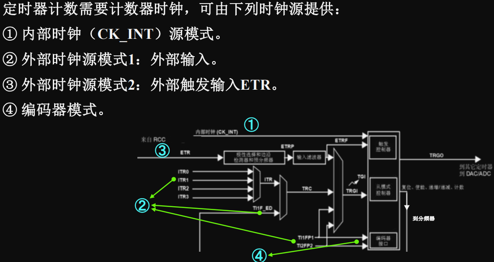
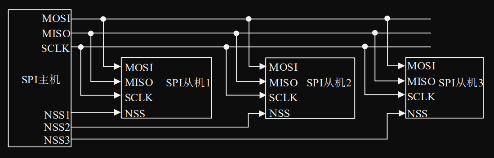

# 嵌入式系统原理与应用（2 学分）

## 2023 考题回忆版

1. 填空 18 分（2 \* 9），基础题目
   - 有几种 SPI 模式？
2. 名词解释 12 分（4 \* 3）
   - NVIC
   - 占空比
   - PLL
   - MOSI
3. 综合 70 分
   - 中断优先级 3 分
   - 给出时钟源图，写 4 个时钟源名称 8 分。（PPT 原题） 
   - 看图，全部挖空，写 SPI 接口名称，6 分 
   - 寄存器地址映射
     - 计算 4 题，8 分
     - 给出公式，问为什么 bit_number **× 4**，2 分
   - 说明什么是大端格式，2 分
   - 读 GPIO 代码
     - 使用了哪些 GPIO 接口？6 分
     - 除了输入，GPIO 还有哪些工作模式？4 分
   - GPIO 原理图，问图上的三个寄存器分别是什么，6 分
   - 读定时器代码，8 分
     - 输出模式？
     - 什么是 arr，psr
     - 计数模式？
   - 按键原理图，问电平，5 分
   - PWM 计算，6 分（PPT 原题：40KHz 占空比=25%PWM 波，内部时钟源=180MHz）
   - 其他忘了

## 考点

重点复习代码：GPIO，定时器中断。给代码考作用（ppt 代码 + 实验代码）。

1. 基本概念，嵌入式系统举例，开发环境举例，如何打断点调试。
2. 大端小端必考，位带映射必考
3. 微控制器常识
   - 开发工具：FPLINK
   - 时钟系统，RTC，timer
   - 芯片大致架构
   - 复位有哪几种，来源有哪些
4. GPIO
   - 解释：通用输入输出
   - **内部构造图**，简单描述过程
   - GPIO 有哪些寄存器
   - **GPIO 的 8 个工作模式**
   - **代码**
5. NVIC
   - 介绍
   - **优先级**
   - 代码
6. 外部中断/事件控制器（EXTI）
   - 非重点
7. 定时器（重点）
   - 用途
   - 结构（重点）
   - 有哪些时钟源
   - 时基单元
   - 计数模式
   - PWM 谁控制周期，谁控制占空比
   - 输出模式
   - 定时的计算
8. IIC
   - 开始/结束信号
   - 主机发送/接收数据流程
9. SPI
   - 四个信号
   - 总线连接
